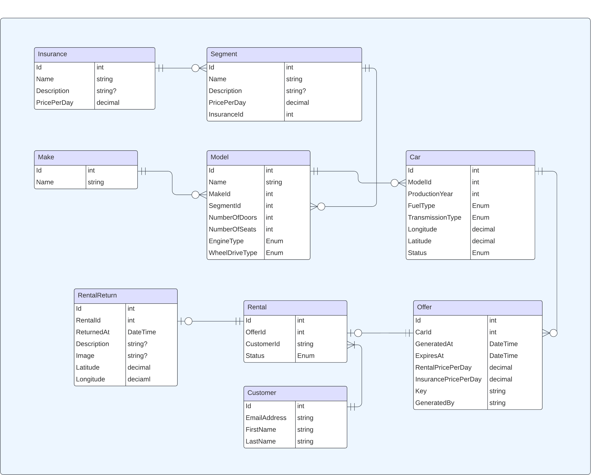
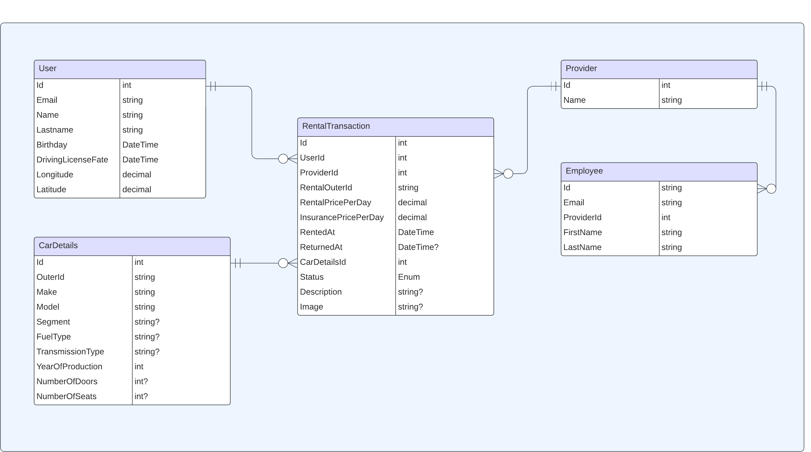

# Wypożyczalnia Samochodów

Projekt realizowany w ramach przedmiotu _Tworzenie aplikacji webowych z wykorzystaniem .NET Framework_ w zimowym semestrze roku akademickiego 2024-2025.

## Spis treści

1. [Opis projektu](#opis-projektu)
2. [Opis Architektury](#opis-architektury)
3. [Architektura usług chmurowych](#architektura-usług-chmurowych)
4. [Schemat bazy danych](#schemat-bazy-danych)
5. [Dokumentacja API](#dokumentacja-api)

## Opis projektu

Projekt zakłada stworzenie kompleksowego systemu do wynajmu samochodów, składającego się z dwóch części:

- aplikacji webowej zbierającej i porównującej ceny ofert wynajmu samochodów,
- API jednego z dostawców samochodów.

System umożliwia użytkownikom wybór i wynajem pojazdów z różnych firm, integrując oferty przy użyciu zewnętrznych API.

## Opis Architektury

Rozwiązanie składa się z 11 projektów, zorganizowanych w sposób modularny, co zapewnia czytelność, łatwość utrzymania i możliwość dalszej rozbudowy systemu.
Projekty te są podzielone na warstwy logiczne, takie jak: **Core**, **Infrastructure**, **API**, **Web**, **Persistence** oraz **Tests**.
Każdy projekt pełni ściśle określoną rolę, co pozwala na wyraźny podział odpowiedzialności i ułatwia zarządzanie kodem.

Diagram przedstawia strukturę podziału na projekty w ramach rozwiązania:

## Architektura usług chmurowych

System został wdrożony w środowisku **Microsoft Azure**, co zapewnia skalowalność, bezpieczeństwo oraz łatwość utrzymania.

Zasoby zostały podzielone na trzy grupy zasobów (**Resource Groups**):

1. `carrental-provider-prod-rg`: Zasoby obsługujące API dostawcy samochodów.

   - `carrental-provider` (**App Service**): Usługa hostująca API dla operacji CRUD na pojazdach, ofertach i rezerwacjach.
   - `carrental-provider-kv` (**Key Vault**): Bezpieczne przechowywanie kluczy, haseł oraz innych tajnych danych.
   - `carrental-provider-ai` (**Application Insights**): Monitorowanie i diagnostyka działania aplikacji w czasie rzeczywistym.
   - `CarRentalProviderDb` (**SQL Database**): Relacyjna baza danych przechowująca informacje potrzebne dostawcy samochodów.

2. `carrental-comparer-prod-rg`: Zasoby obsługujące API porównywarki cen, obsługujące poszczególne wypożyczalnie samochodów.

   - `carrental-comparer` (**App Service**): Usługa hostująca API odpowiedzialne za porównywanie ofert.
   - `carrental-comparer-kv` (**Key Vault**): Bezpieczne przechowywanie kluczy, haseł oraz innych tajnych danych.
   - `carrental-comparer-ai` (**Application Insights**): Monitorowanie działania aplikacji i zbieranie metryk diagnostycznych.
   - `CarRentalComparerDb` (**SQL Database**): Relacyjna baza danych obsługująca funkcjonalności porównywania ofert.
   - `carrental-comparer-web` (**Static Apps**): Hostowanie aplikacji frontowej, która udostępnia interfejs użytkownika końcowego.

3. `carrental-common-prod-rg`: Zadoby wspólne dla obu części rozwiązania, takie jak przechowywanie plików oraz pamięć podręczna.
   - `carrentalminisa` (**Blob Storage**): Przechowywanie plików statycznych, takich jak zdjęcia pojazdów oraz logo marek samochodów.
   - `carrental-cache` (**Azure Cache for Redis**): Pamięć podręczna wykorzystywana do przyspieszenia operacji odczytu, np. przechowywanie wyników wyszukiwania.

## Schemat bazy danych

Poniżej przedstawiono diagramy ilustrujące strukturę baz danych, relacje między tabelami oraz kluczowe atrybuty.

### Diagram bazy danych dostawcy samochodów:

### Diagram bazy danych porównywarki cen:

## Dokumentacja API

Dokumentację dla obu API można znaleźć pod następującymi adresami (w środowisku deweloperskim):

- `CarRental.Provider.API`: `https://localhost:7173/swagger/index.html`
- `CarRental.Comparer.API`: `https://localhost:7016/swagger/index.html`

Dokumentacja zawiera szczegółowy opis dostępnych endpointów, wymaganych parametrów oraz przykładów odpowiedzi.
